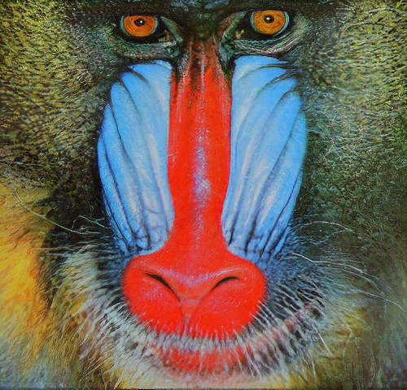

# SRGAN: Super-Resolution with Generative Adversarial Networks

### Introduction
This project is a tensorflow implementation of the impressive work  [Photo-Realistic Single Image Super-Resolution Using a Generative Adversarial Network](https://arxiv.org/pdf/1609.04802.pdf).

In this work, we focus on reimplement and optimizing SRGAN for multi-GPU and TPU systems to accelerate training and unleash its full potential in high-performance computing environments and testing on medical image.

I train my network on the [Chest X-Ray Images (Pneumonia)](https://www.kaggle.com/datasets/paultimothymooney/chest-xray-pneumonia) dataset with 5,863 X-Ray images (JPEG) and 2 categories (Pneumonia/Normal).

#### Some results from paper:

<table >
    <tr >
    	<td><center>Inputs</center></td>
        <td><center>SRGAN result</center></td>
        <td><center>Original</center></td>
    </tr>
    <tr>
    	<td>
    		<center></center>
    	</td>
        <td>
        	<center></center>
        </td>
        <td>
        	<center></center>
        </td>
    </tr>
    <tr>
    	<td><center>Inputs</center></td>
        <td><center>SRGAN result</center></td>
        <td><center>Original</center></td>
    </tr>
    <tr>
    	<td>
    		<center></center>
    	</td>
        <td>
        	<center></center>
       </td>
       <td>
        	<center></center>
        </td>
    </tr>
</table>

### Denpendency
* python3.10
* tensorflow2.15
* The code is work on Ubuntu 20.04.6 LTS

### Recommended

* Ubuntu 20.04 with tensorflow GPU edition
* Kaggle or Colab free version.
* I implement code on [Kaggle Notebook](https://www.kaggle.com/code/pnmanh2123/srgan).

### Getting Started

```bash
git clone https://github.com/mxmm2123/SRGAN-for-medical-image-enhance.git
```
Download the [dataset](https://www.kaggle.com/datasets/paultimothymooney/chest-xray-pneumonia). The dataset contains the 5,863 X-Ray images (JPEG) and 2 categories (Pneumonia/Normal).

Your dataset structure should like:

```bash
./data/
├── train
│   └── you image...
└── test
    └── you image...
```

